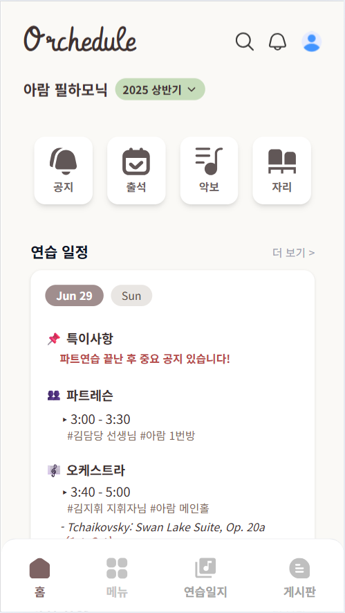
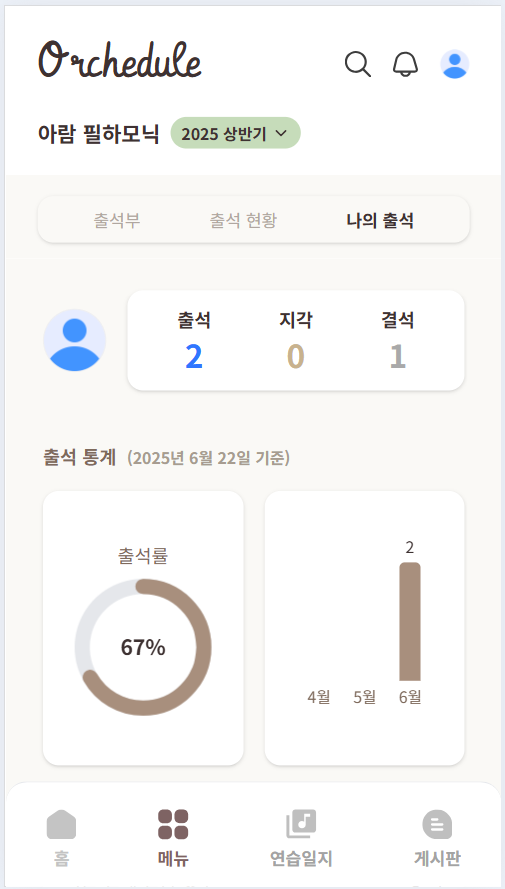
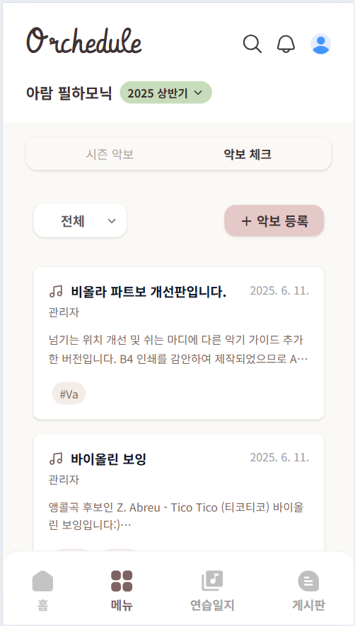

# orchedule
오케스트라를 위한 연습 일정 알림, 출석체크 및 자료 관리 사이트

## 🚀 배포 주소

- [https://www.orchedule.live](https://www.orchedule.live)

## 🖥️ 프로젝트 소개
제가 활동했던 오케스트라 단체에서 사용하고 싶어서 만든 연습 일정 알림 및 자료 관리 서비스입니다. 

원래 네이버 밴드를 통해 관리하고 있었던 연습 일정과 출석 확인, 필요한 자료 찾기 기능 등 불편했던 기능들 위주로 개발을 시작하게 되었습니다. 

## 🕰️ 개발 기간

- 프로젝트 시작: 2025년 3월 21일  
- 현재까지 기능 추가 및 유지보수 중

### 🧑‍🤝‍🧑 맴버구성
- 권채림 : 처음부터 끝까지 혼자 개발해보고 싶어서 단독 개발 진행

### ⚙️ 개발 환경
- `Node.js 18.x`  
- `Next.js 14.x`  
- **IDE** : VS Code  
- **Framework** : Next.js
- **Backend** : Node.js 
- **Database** : MongoDB (MongoDB Atlas)  
- **ORM** : Mongoose  
- **Deployment** : Vercel  

## 📌 주요 기능

- **연습 일정 관리**
  - 달력 기반의 연습 일정 조회
  - 파트별 세션, 오디션, 특이사항 등 다양한 유형의 일정 등록 가능

- **출석 체크**
  - 로그인한 사용자가 당일 연습에 대한 출석/지각/불참 여부 선택
  - 관리자는 단원별 출석 현황 확인 및 수정 가능
  - 나의 출석 통계 및 출석 로그 확인 (출석률, 월별 통계 등)

- **공지사항**
  - 시즌별 공지 등록 및 확인
  - 이미지, PDF 파일 첨부 및 미리보기 지원
  - 검색 및 필터 기능 제공

- **악보 관리**
  - 시즌악보와 악보체크 탭으로 구분하여 업로드/열람 가능
  - 파트별 필터링 및 태그 기반 검색 기능

- **자리 배치**
  - 시즌별 단원 좌석 배치 등록 및 편집

- **단원 관리**
  - 가입 요청 승인/거절 기능
  - 단원 정보 등록 및 수정
  - 시즌별 참여 단원 설정

- **통합 검색 기능**
  - 공지, 악보, 자료 등을 키워드로 검색 가능
  - 모바일/데스크탑 환경 모두에서 검색 UI 최적화

- **PWA 지원**
  - 모바일 홈 화면에 앱 설치 가능
  - 일부 기능은 오프라인에서도 접근 가능
 

## 📸 서비스 미리보기

| 홈 화면 | 출석 | 악보 |
|:--:|:--:|:--:|
|  |  |  |

 

## 🛠 개발 예정 기능

- 게시판 기능 
- 연습일지 작성 및 통계 기능
- 다크모드 및 테마 설정
- 알림 기능 (출석 미체크 알림, 일정 변경 푸시 등)
